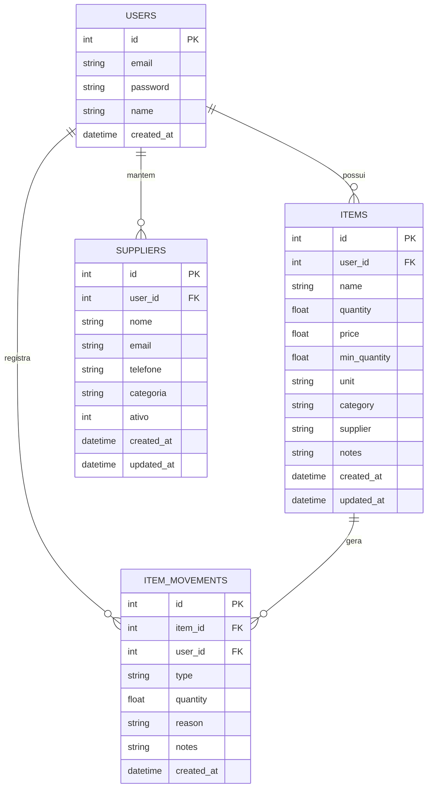

# Flowchart do Banco de Dados - Juba Estoque

## 1. Modelo relacional (resumo)

## 2. Regras de negocio refletidas no banco

- cada usuario enxerga apenas seus dados (`user_id`)
- produtos possuem quantidade minima para alerta (`min_quantity`)
- movimentacoes registram historico imutavel por item
- exclusao de item remove movimentacoes vinculadas (`ON DELETE CASCADE`)

## 3. Fluxo de dados principal

1. Usuario cria item em `items`
2. Sistema registra movimentacao inicial em `item_movements`
3. Ajustes de estoque geram novas movimentacoes
4. Relatorios calculam indicadores a partir de `items`

## 4. Consultas de relatorio derivadas

- valor total: `SUM(quantity * price)`
- itens criticos: `quantity <= min_quantity`
- agrupamento por categoria: `GROUP BY category`
